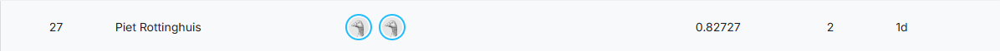

University of California Santa Cruz  
CSE 144 Applied Machine Learning Final Project  
Piet Rottinghuis  
Elina Wilson  

### Trained Model Weights: [Link](https://drive.google.com/file/d/1RwQEFVAAv67fvc7dnA2dMUzoNMN6SHmd/view?usp=sharing)
### Kaggle submission:


## How To Use

Prerequisites:
- Must have [Docker](https://www.docker.com/) installed on your machine
- Must have the Kaggle dataset downloaded and available in the `data/` directory in the project root.

*Note: The docker image is designed to run on a CUDA system.*

The project root should contain a `data/` directory with the downloaded Kaggle dataset organized as follows:

```
cse144-final-project/
├── data/
│   ├── train/
│   ├── test/
│   └── sample_submission.csv
├── src/
├── configs/
├── outputs/
├── train.py
├── inference.py
├── Dockerfile
└── ...
```

### 1. Environment setup
Navigate to the project root directory and build the docker image:
```bash
cd ~/.../cse144-final-project
docker build -t cse144-final:latest .
```

This step may take multiple minutes.

The docker image will contain this repository. When we run it, the training and testing data will exist in /app/data. We will need to
mount our output directory over the copied version of `./outputs`.

## Training

Training runs have config files associated with them which allow you to specify the checkpoint to load, number of unfrozen layers, learning rates, epochs, etc. Fully training a model involves a series of different configs, an example of which is provided in the `2.1.yml` to `2.4.yml` series.

For this example, we will demonstrate a final cooldown phase of training with the model in our final submission, using the config `final_submission.yml`.
To test it, please download the model weights from the [link](https://drive.google.com/file/d/1RwQEFVAAv67fvc7dnA2dMUzoNMN6SHmd/view?usp=sharing) and place it directly in the ouputs directory.

Next, run the training script using the docker container. It is important to make sure that the shared memory size is large enough 
for the dataloaders. We set it to 8GB here. We also mount the output and config directories so that we can access them.

```bash
docker run --rm --gpus all --shm-size=8g -v ./outputs/:/app/outputs cse144-final:latest \
python train.py --config /app/configs/efficientnet/final_submission.yml
```

This will generate a new entry into `outputs/manifest.tsv` and create the associated directory with the run. Logging messages will display in the terminal and be saved
to `./outputs/<run_id>/training.log`. The best and last checkpoints will be saved to the run directory, along with training history, metrics, and plots.

Example manifest entry after 2 training runs:
```
run_id	timestamp	model_name	epochs	batch_size	run_dir
run_20260604_213526_fe56	2026-06-04T21:35:26.593249	EfficientNet_V2_S	20	15	outputs/run_20260604_213526_fe56
run_20260608_000035_2ca3	2026-06-08T00:00:35.335291	EfficientNet_V2_S	60	10	outputs/run_20260608_000035_2ca3
```

Example output directory structure after 2 training runs:
```
outputs/
├── manifest.tsv
├── run_20260604_213526_fe56/
│   ├── best_checkpoint.pth
│	├── config.yaml
│	├── history.tsv
│	├── last_checkpoint.pth
│	├── metrics.json
│	├── training.log
│	└── training_plots.png
└── run_20260608_000035_2ca3/
	├── best_checkpoint.pth
	├── config.yaml
	├── history.tsv
	├── last_checkpoint.pth
	├── metrics.json
	├── training.log
	└── training_plots.png
```

### 3. Evaluate on the test data to generate a submission

Now that the training is complete, we will use the container to evaluate the model on the test data.

Look in `./outputs/manifest.tsv` to find the run_id of the training run you want to evaluate. The id for the most recent run can be found in the first colomn in the bottom row.

For example, the most recent run ID in the example manifest below is `run_20260608_000035_2ca3`.

```
run_id	timestamp	model_name	epochs	batch_size	run_dir
run_20260604_213526_fe56	2026-06-04T21:35:26.593249	EfficientNet_V2_S	20	15	outputs/run_20260604_213526_fe56
run_20260608_000035_2ca3	2026-06-08T00:00:35.335291	EfficientNet_V2_S	60	10	outputs/run_20260608_000035_2ca3
```

Run the following command, replacing <run_id> with the actual run_id.

```bash
docker run --rm --gpus all --shm-size=8g -v ./outputs/:/app/outputs cse144-final:latest \
python inference.py --checkpoint /app/outputs/<run_id>/best_checkpoint.pth --outfile /app/outputs/submission.csv
```

Find the generated `submission.csv` at `./outputs/submission.csv`. This file can be submitted to Kaggle for evaluation.

## Developer environment setup

Instructions for setting up a local development environment. This is useful for debugging and iterating on the code outside of the docker container.

We first create a base conda environment. This environment contains the Python installation and core scientific packages. It is designed to be independent of the project code and does not include deep learning frameworks such as PyTorch.

```bash
conda env create -f environment.yml
```

Activate the environment:

```bash
conda activate cse144-final
```

Install PyTorch (GPU-enabled backend)

PyTorch is installed separately because its installation depends on system-specific CUDA configuration. This ensures compatibility across different machines (e.g., local GPU machines, Colab, or lab servers).
```bash
python -m pip install torch torchvision
```

Install project package

Finally, install the project in editable mode. This allows the source code in src/ to be imported as a Python package and ensures that changes to the code are immediately reflected without needing to reinstall.
```bash
python -m pip install -e .
```
